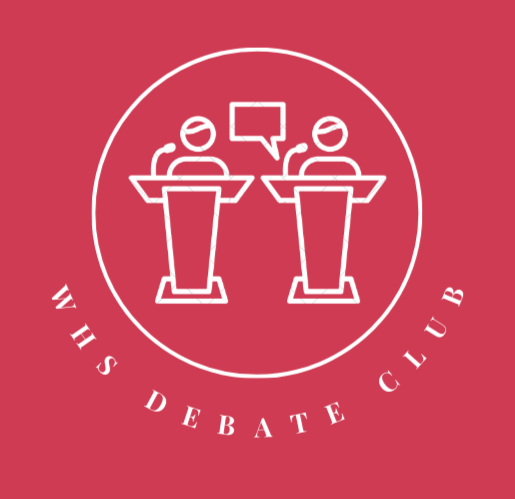
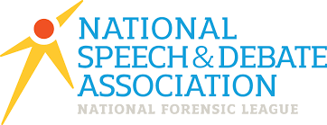

# WHS Debate Club 
Welcome to the official page for the WHS Debate Club! 

## Our Mission
The Whitney High School Debate Club seeks to raise awareness on important global issues, by increasing exposure to these topics through teaching speech and debate events. Debates  revolve around various resolutions - domestic and global. Through this, we endeavor to reduce the number of bystanders in our world, and increase the number of students who care about the world around us. 

## About Tournaments 
We participate in tournaments in the Southern California Debate League, the California High School Speech Association, and the National Speech and Debate Association. Let us know if you would like to attend any tournaments in the jurisdiction of these three leagues! 
 

### Upcoming Tournaments 
- [The CSUF Invitational](https://www.tabroom.com/index/tourn/index.mhtml?tourn_id=24581) | 10/14 to 10/16

## General Meetings
- October 10th | Ms. Schulman's room | Lunch 

